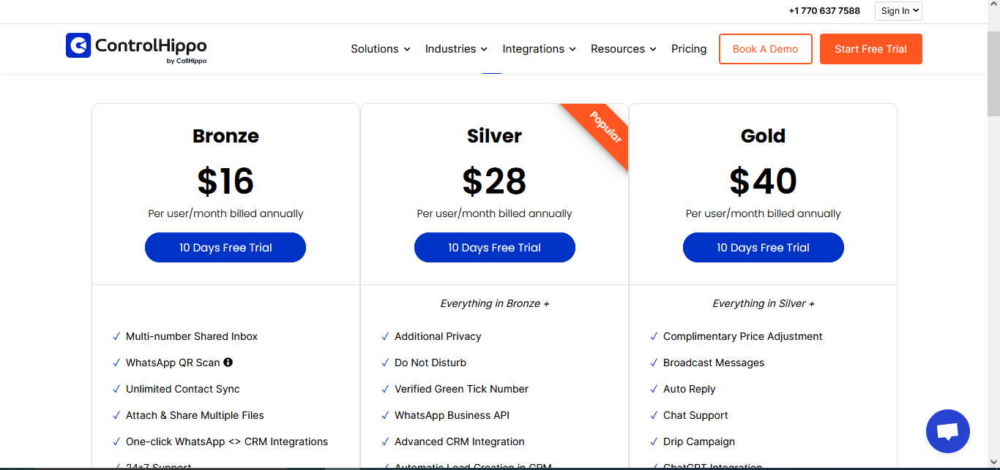
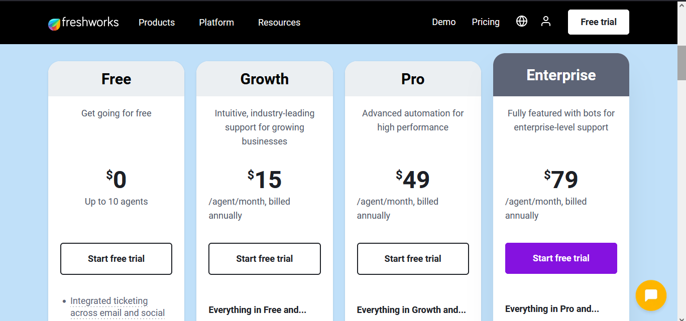
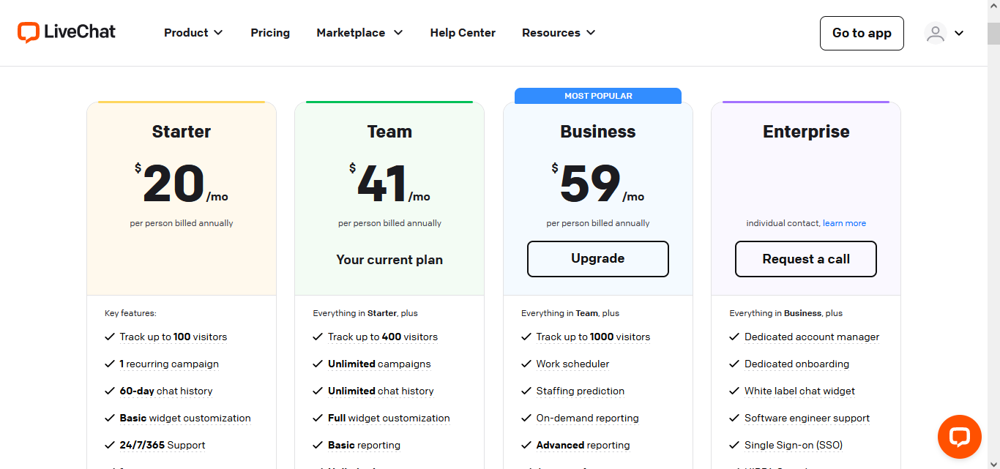

# Report ㊗
## Companys : 
* [ControlHippo .](https://controlhippo.com/pricing/)
    - ControlHippo image : 
        
    
    - Technolgy :
        - CMS : WordPress 6.4.3
        - Live chat : Crisp Live Chat *,* WhatsApp Business Chat
        -  SEO : Yoast SEO
    
    - Multiple Platforms :
        - Available on Web
        - Download on Android
        - Download on ios
        - Get Extension Chrome Store
    
    - Channels : 
        - WhatsApp Shared Inbox 
        - Controllhippo WhatsApp Shared Inbox
        - WhatsApp Business API 
        - Controllhippo WhatsApp Business API
        - Telegram 
        - Controllhippo Telegram
        - Instagram 
        - Controllhippo Instagram
    - Integrations : 
        - PipeDrive => SALES AUTOMATION
        - Hubspot => CRM  
        - Zoho => CRM 
        - Slack => PRODUCTIVITY 
        - Zendesk => CRM  
        - Monday => CRM 
        - Google Sheets => PRODUCTIVITY  
        - WooCommerce => CRM 
        - Shopify => CRM 
        - Webhooks => Productivity  
* [Freshdesk .](https://www.freshworks.com/freshdesk/helpdesk-software-bex/?utm_source=mvfglobal&utm_medium=cpc&utm_campaign=en-helpdesk&tactic_id=3603167&aclid=st3ZDYoX2AgpikDo78Lp&apid=OVFzVA&asid=NO_SESSION_COOKIE&aref=https%3A%2F%2Fappwiki.nl&atemp=default)
    - Freshdesk image : 
        
    - Technolgy :
        - Web frameworks 
            - Nextjs
        -  JavaScript frameworks
            - Next.js 12.3.1
            - Emotion
            - styled-components 5.3.6
            - React
        -  SEO : Yoast SEO
        - UI frameworks 
            - M UI
            - styled-components
            - Emotion
    -
* [LiveChat .](https://ppctrack.softwaresuggest.com/livechat-aff)
    - LiveChat image :
        
    
    - LiveChat's AI features include:

        - AI Assist: 
            - This is an agent's assistant that enhances agents' writing by matching the tones of the messages to the customers' situations. It allows you to rephrase, summarize, or expand your messages. It corrects your grammar and spelling mistakes and even generates texts based on your input.

        - Automated workflows: 
            - AI can automate routine and repetitive tasks, such as order processing, tracking, or account management. This reduces the manual effort for agents and enables them to focus on more complex customer issues.

        - Predictive analytics: 
            - AI algorithms can analyze customer data and historical patterns to predict customer behavior, preferences, and potential issues. This information empowers agents to proactively address customer concerns, provide personalized recommendations, or offer targeted solutions.

        - Chatbots: These 
            - are automated conversational agents designed to simulate human-like interactions via text or voice. They engage in customer interactions, interpret requests, and provide appropriate responses based on sensitive data, predefined scenarios, or machine learning algorithms.

        - Canned Suggestions: 
            - These are pre-written responses that can be used to answer common customer queries quickly.

        - Sentiment Analysis: 
            - This feature analyzes the tone of the customer's messages to understand their sentiment and respond appropriately.

        - Text Enhancements: 
            - This feature improves the quality of the agent's messages by correcting grammar and spelling mistakes.

        - Tag Suggestions: 
            - This feature suggests relevant tags based on the context of the conversation, helping to categorize and organize chats.

        - Spelling Check: 
            - This feature checks and corrects any spelling mistakes in the agent's messages.

        - Automated Insights: 
            - This feature provides insights and analytics based on the chat data.

        - Response Suggestions: 
            - This feature suggests responses to the agent based on the context of the conversation.

# summary :
- ## api for all social media accounts
- ## nice design .
- ## Generate statistics on customer opinions . 
- ## Deflect common customer questionsDocument FAQs, how-tos, and help-guides to help your customers and your team find answers quickly == tamplete.
- ## Make a conversation with the customer if he has a website (pop chat).
- ## feature checks and corrects any spelling mistakes in the messages.
- ## multi platforms (react native => ios, android) / if we want make desktop app, we can use electronjs for (mac,windows,linux) .
- ## we can make store package for many feature to make user buy package to incress the results.
- ## export the result in file excel google sheet (analysis)
- ## we have to make sample connection with botbot to the account the user eg.(massanger, whatsapp, telegram), be simple way to connect with them.  